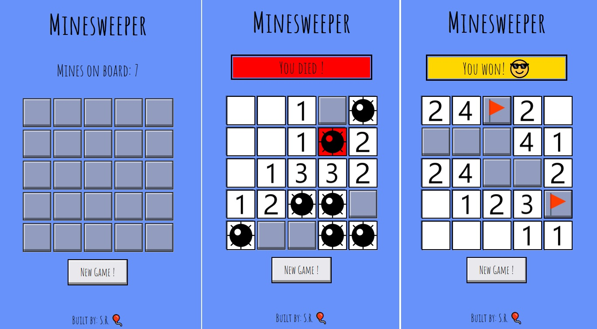

# My-Minesweeper

My take on this classic.

##### *Timeline:*
###### 2019 - First commit & programming done
###### 2023 - Visual identity refreshed

### Preview

Live version : [Minesweeper](https://max1mmus.github.io/My-Minesweeper/)

### Visual layout of the game

 ### Made with:
 
 * Pure JavaScript
 * CSS
 * HTML
 
 You can use right click to plant flags
 
###### Special thanks to @dejanpaca for giving me some pointers (this was my first project ever)

### After you clone repo :

1. run `npm install` to install packages.
2. run `npm run open` to start local serv. @ http://localhost:1234
